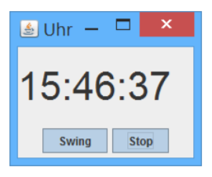

# team-04-watch
Watch Project Team 4

## Einleitung
In diesem Git-Repository soll im Rahmen des Software Engineering und Programmieren ein Projekt entstehen.

## Ziele
Es soll eine Uhr erstellt werden, welche auf dem Desktop eines MAC/Windows/Linux- Computer
laufen kann. Die Uhr soll konfigurierbar sein.

In einer **ersten Ausbaustufe** soll eine Digitaluhr erstellt werden. Die Uhr kann gestartet und gestoppt
werden. Die Position der Uhr auf dem Desktop soll gespeichert werden. D.h. beim nächsten Starten
des Programms soll die Uhr am gleichen Ort stehen.

In einer **zweiten Ausbaustufe** soll die Digitaluhr mittels Konfigurationsdialog konfiguriert werden
können. Die Konfiguration betrifft die Dialog-Hintergrundfarbe und die Schriftfarbe. Weiter wäre es
optional wünschenswert die Schriftgrösse einzustellen. Die Konfiguration wird automatisch in einer
Datei gespeichert. Beim Starten der Uhr wird die Datei eingelesen.

In einer **dritten Ausbaustufe** sollen mehrere Digitaluhren angezeigt werden. Die Konfiguration soll
gemäss Ausbauschritt zwei möglich sein. Zudem soll die Zeitzone konfiguriert und angezeigt werden.

In einer **vierten Ausbaustufe** soll wahlweise eine Digital-oder eine Analoguhr angezeigt werden. Das
Aussehen der Analoguhr soll konfiguriert werden können.

## Rahmenbedingungen

## Build-Anleitung

## Bedienungsanleitung

Die Uhr wird mit dem Ausfuehren des Programmes gestartet. 
Sie koennen sowohl die Position der Uhr als auch Ihre groesse veraendern, wird die Uhr geschlossen und wieder gestartet
erscheint diese am selben Ort und in der selben Groesse.

Mit dem Start und Stop Button koennen Sie die Uhr anhalten (Stop) und mit aktueller zeit weiterlaufen lassen (Start).

## User Stories Backlog

* Als Computer Anwender moechte ich die Zeit sehen, um zu wissen wie 	spaet es ist.
* Als Uhren Benutzer moechte ich die Uhr anhlaten, um mir einen 		bestimmten Zeitpunkt einzupraegen
* Als Uhren Anwender moechte ich die Uhr starten, damit mir sofort 		die aktuelle Zeit angezeigt wird.
* Als Kunstliebhaber moechte ich die Zeit als Digitaluhr ablesen koennen, damit ich eine andere Darstellungsform machen kann
* Als Designer moechte ich die Hintergrundfarbe und die Schriftfarbe veraendern koennen.
* Als Computer Anwender moechte ich die aktuelle Konfiguration speichern, damit die Anwendunf beim naechsten Start im gleichen Zustand ist.
* Als Uhrenkenne moechte ich mehrere Uhren auf dem Bildschirm haben, damit ich verschiedene Konfigurationen gleichzeitig geoeffnet haben kann
* Als Weltenbummler moechte ich verschiedene Uhren mit verschiednenen Zeitzone sehen, damit ich verschiedene Zeitzonen im Blick habe.
* Als Designer moechte ich zwischen der Digtalen und der Analogen Uhrenanziege wechseln koennen, damit ich die Oberflaeche personalisieren kann.

## Dokumentation Sprint Ausbaustufe 1
##### User Story Sprint backlog
1. Als Computer Anwender moechte ich die Zeit sehen, um zu wissen wie spaet es ist.  
	* Akzeptanzkriterium: Zeit wird in einem JFrame angezeigt.  
	* Aufwandschaetzung: 3 Storypoints  
2.  Als Uhren Benutzer moechte ich die Uhr anhalten, um mir einen bestimmten Zeitpunkt einzupraegen  
	* Akzeptanzkriterium: Im Programmframe ist ein Stoppbutton 	vorhanden welcher die Uhr zum aktuellen Zeitpunkt einfriert  
	* Aufwandschaetzung: 1 Storypoint  
3.  Als Uhren Anwender moechte ich die Uhr starten, damit mir sofort die aktuelle Zeit angezeigt wird.  
	* Akzeptanzkriterium: Im Programmframe ist ein Startbutton vorhanden welcher die Uhr startet und jede Sekunde aktualisiert.  
	* Aufwandschätzung: 1 Storypoint	
	
Nachfolgend ein Bild der 1. Ausbaustufe

##### UML - Klassendiagramm

	

>>>>>>> branch 'master' of https://github.com/trinat-ampere/team-04-watch.git
